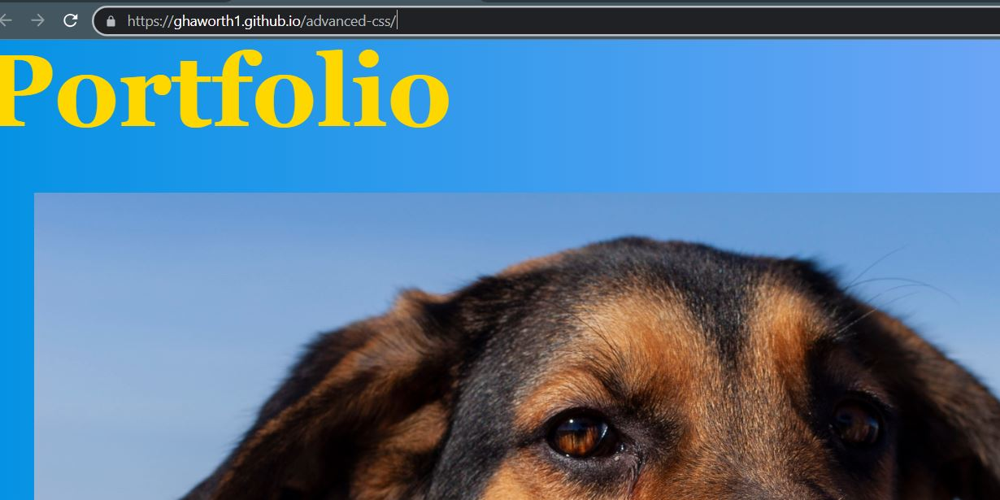

# advanced-css
Homework for the Advanced CSS unit

# Advanced CSS Homework

The challenge for this unit was to build a portfolio webpage from scratch, with working links and has responsive layout.

## Live Link

[Link to site](https://ghaworth1.github.io/advanced-css/)

## Authors

- [@ghaworth1](https://www.github.com/ghaworth1)

## Screenshots

## License

[MIT](https://choosealicense.com/licenses/mit/)